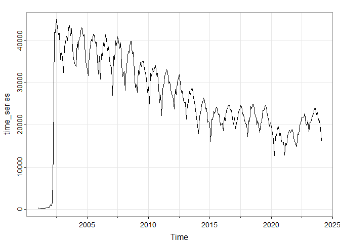
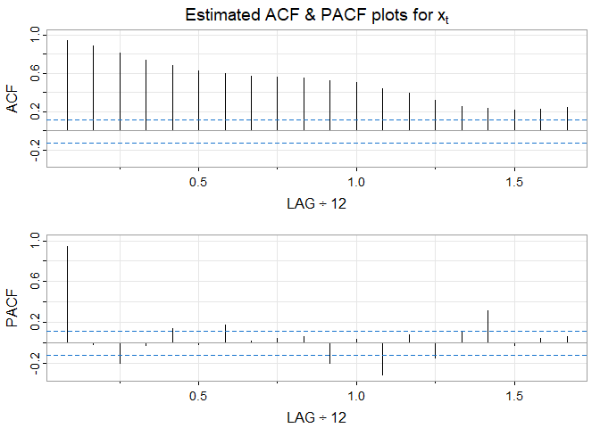
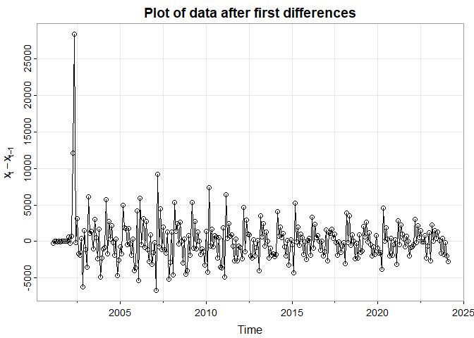
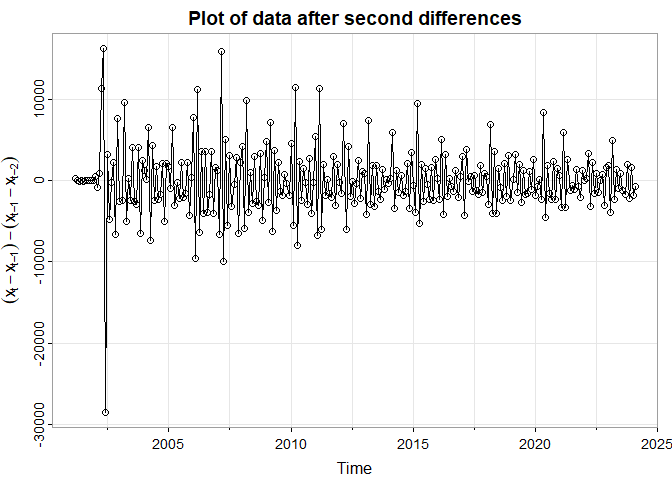
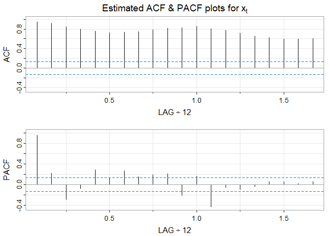
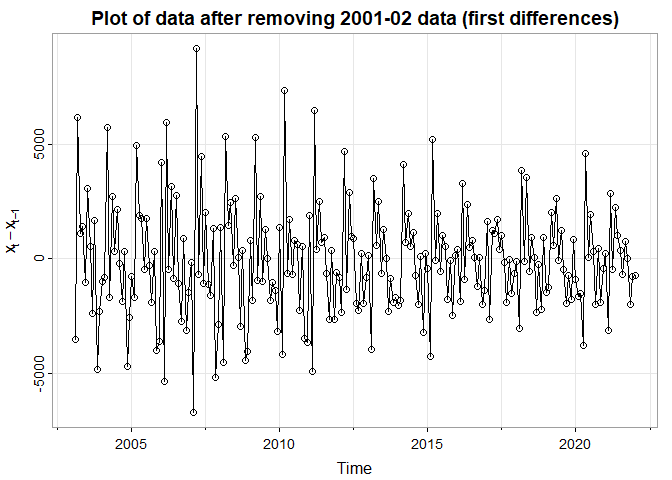

Forecasting Chicago Crimes
================
Kushal Navghare
2024-03-04

``` r
rm(list=ls())
library(lubridate)
```

    ## 
    ## Attaching package: 'lubridate'

    ## The following objects are masked from 'package:base':
    ## 
    ##     date, intersect, setdiff, union

``` r
library(dplyr)
```

    ## 
    ## Attaching package: 'dplyr'

    ## The following objects are masked from 'package:stats':
    ## 
    ##     filter, lag

    ## The following objects are masked from 'package:base':
    ## 
    ##     intersect, setdiff, setequal, union

``` r
library(tidyr)
library(astsa)
library(ggplot2)
library(stringr)
```

``` r
setwd("C:/Users/kusha/Documents/RStudio/")
# read csv
raw_df <- read.csv("Crimes_-_2001_to_Present_20240306.csv")
```

``` r
transfrm_df <- raw_df %>% 
  mutate(New.Date = format(as.POSIXct(raw_df$Date, format = "%m/%d/%Y %I:%M:%S %p"), "%Y-%m-%d")) %>% 
  na.omit() %>% 
  mutate(YRMO = substr(New.Date, start=1, stop=7))

dff <- transfrm_df %>%
  mutate(New.Date = as.Date(New.Date, format = "%Y-%m-%d")) %>% 
  group_by(YRMO) %>% 
  summarise(total_count = n_distinct(Case.Number))
```

``` r
time_series <- ts(dff[, -1], frequency = 12, start =2001)
crimes <- aggregate(time_series, nfrequency=12)
tsplot(time_series)
```

<!-- -->

``` r
# look at acf/pacf plots
acf2(crimes, max.lag=20, main=expression(paste("Estimated ACF & PACF plots for ", x[t])))
```

<!-- -->

    ##      [,1]  [,2]  [,3]  [,4] [,5]  [,6] [,7] [,8] [,9] [,10] [,11] [,12] [,13]
    ## ACF  0.94  0.89  0.81  0.74 0.68  0.62 0.60 0.57 0.56  0.56  0.53  0.51  0.44
    ## PACF 0.94 -0.02 -0.21 -0.03 0.14 -0.02 0.17 0.02 0.04  0.06 -0.20  0.04 -0.31
    ##      [,14] [,15] [,16] [,17] [,18] [,19] [,20]
    ## ACF   0.39  0.32  0.25  0.23  0.22  0.23  0.24
    ## PACF  0.08 -0.15  0.11  0.32 -0.03  0.04  0.06

``` r
# first order difference
first_order_diff <- diff(crimes, lag=1, differences=1)
second_order_diff <- diff(first_order_diff, lag=1, differences = 1)
```

``` r
tsplot(first_order_diff, ylab=expression(x[t]-x[t-1]), type="o", main="Plot of data after first differences")
```

<!-- -->

``` r
tsplot(second_order_diff, ylab=expression((x[t]-x[t-1]) - (x[t-1]-x[t-2])), type="o", main="Plot of data after second differences")
```

<!-- -->

Year 2001 does not exhibit the same seasonal patterns and trends as the
rest of the time. series.

It deviates significantly from typical seasonal patterns, removing it
may help improve the accuracy of forecasting models.

``` r
# filter data
new_crimes <- window(crimes, start = c(2003), end=c(2022))

acf2(new_crimes, max.lag=20, main=expression(paste("Estimated ACF & PACF plots for ", x[t])))
```

<!-- -->

    ##      [,1] [,2]  [,3]  [,4] [,5] [,6] [,7] [,8] [,9] [,10] [,11] [,12] [,13]
    ## ACF  0.94 0.91  0.85  0.80 0.76 0.73 0.74 0.75 0.78  0.82  0.83  0.85  0.80
    ## PACF 0.94 0.22 -0.28 -0.08 0.28 0.13 0.27 0.14 0.19  0.20 -0.21  0.16 -0.43
    ##      [,14] [,15] [,16] [,17] [,18] [,19] [,20]
    ## ACF   0.78  0.71  0.66  0.62  0.59  0.59  0.60
    ## PACF -0.06 -0.10 -0.04  0.06  0.05  0.02  0.05

``` r
new_first_order_diff <- diff(new_crimes, lag=1, differences = 1)

tsplot(new_first_order_diff, ylab=expression(x[t]-x[t-1]), type="o", main="Plot of data after removing 2001-02 data (first differences)")
```

<!-- -->

Model suggestions:

MA(1): Given the significant autocorrelation at lag 1 and no significant
partial autocorrelations beyond lag 1, a simple MA(1) model could be
appropriate.

ARIMA(1,0,1): This model includes an autoregressive component of order 1
(AR(1)), a moving average component of order 1 (MA(1)), and no
differencing (d=0). It captures both short-term autocorrelation and
short-term moving average effects.

ARIMA(1,1,1):

SARIMA(1,0,1)(1,0,1)\[12\]: This model includes both non-seasonal and
seasonal autoregressive and moving average components. The non-seasonal
components capture short-term dependencies, while the seasonal
components capture repeating patterns.

SARIMA(0,1,1)(0,1,1)\[12\]: This model includes first-order differencing
both for non-seasonal and seasonal components, along with a seasonal
moving average component. It’s useful for handling trends and seasonal
patterns.

SARIMA(1,1,1)(1,1,1)\[12\]: This model includes first-order differencing
for both non-seasonal and seasonal components, along with autoregressive
and moving average components for both non-seasonal and seasonal
patterns.

SARIMA(0,1,2)(0,1,1)\[12\]: This model includes first-order differencing
for both non-seasonal and seasonal components, along with a seasonal
moving average component and two non-seasonal moving average components.
It’s suitable for data with strong seasonal patterns and short-term
dependencies.

``` r
# load source file
source("examine.mod.R")
```

``` r
# Build a MA(1) model
dev.new(width=8, height=6)
ma1_model <- sarima(new_crimes, p = 0, d = 0, q = 1)
```

    ## initial  value 8.966633 
    ## iter   2 value 8.805674
    ## iter   3 value 8.690744
    ## iter   4 value 8.608205
    ## iter   5 value 8.564337
    ## iter   6 value 8.547066
    ## iter   7 value 8.537637
    ## iter   8 value 8.536498
    ## iter   9 value 8.536105
    ## iter  10 value 8.536092
    ## iter  11 value 8.536090
    ## iter  12 value 8.536090
    ## iter  13 value 8.536090
    ## iter  13 value 8.536090
    ## iter  13 value 8.536090
    ## final  value 8.536090 
    ## converged
    ## initial  value 8.531325 
    ## iter   2 value 8.531167
    ## iter   3 value 8.531150
    ## iter   4 value 8.531138
    ## iter   4 value 8.531138
    ## iter   4 value 8.531138
    ## final  value 8.531138 
    ## converged
    ## <><><><><><><><><><><><><><>
    ##  
    ## Coefficients: 
    ##         Estimate       SE t.value p.value
    ## ma1       0.7448   0.0295 25.2418       0
    ## xmean 28169.3467 582.4642 48.3624       0
    ## 
    ## sigma^2 estimated as 25616408 on 227 degrees of freedom 
    ##  
    ## AIC = 19.92635  AICc = 19.92659  BIC = 19.97134 
    ## 

``` r
ma1_model
```

    ## $fit
    ## 
    ## Call:
    ## arima(x = xdata, order = c(p, d, q), seasonal = list(order = c(P, D, Q), period = S), 
    ##     xreg = xmean, include.mean = FALSE, transform.pars = trans, fixed = fixed, 
    ##     optim.control = list(trace = trc, REPORT = 1, reltol = tol))
    ## 
    ## Coefficients:
    ##          ma1       xmean
    ##       0.7448  28169.3467
    ## s.e.  0.0295    582.4642
    ## 
    ## sigma^2 estimated as 25616408:  log likelihood = -2278.57,  aic = 4563.14
    ## 
    ## $degrees_of_freedom
    ## [1] 227
    ## 
    ## $ttable
    ##         Estimate       SE t.value p.value
    ## ma1       0.7448   0.0295 25.2418       0
    ## xmean 28169.3467 582.4642 48.3624       0
    ## 
    ## $ICs
    ##      AIC     AICc      BIC 
    ## 19.92635 19.92659 19.97134

``` r
examine.mod(ma1_model, 0, 0, 1)
```

``` r
# Build a ARIMA(1,0,1) model
dev.new(width=8, height=6)
ar101_model <- sarima(new_crimes, p = 1, d = 0, q = 1)
```

    ## initial  value 8.966660 
    ## iter   2 value 8.617451
    ## iter   3 value 8.099764
    ## iter   4 value 7.989913
    ## iter   5 value 7.987018
    ## iter   6 value 7.849193
    ## iter   7 value 7.792986
    ## iter   8 value 7.782570
    ## iter   9 value 7.778916
    ## iter  10 value 7.774236
    ## iter  11 value 7.773690
    ## iter  12 value 7.773677
    ## iter  13 value 7.773644
    ## iter  14 value 7.773523
    ## iter  15 value 7.773294
    ## iter  16 value 7.773179
    ## iter  17 value 7.773152
    ## iter  18 value 7.773147
    ## iter  19 value 7.773127
    ## iter  20 value 7.773062
    ## iter  21 value 7.772976
    ## iter  22 value 7.772882
    ## iter  23 value 7.772864
    ## iter  24 value 7.772851
    ## iter  25 value 7.772844
    ## iter  26 value 7.772843
    ## iter  27 value 7.772835
    ## iter  28 value 7.772832
    ## iter  29 value 7.772831
    ## iter  29 value 7.772831
    ## final  value 7.772831 
    ## converged
    ## initial  value 7.779489 
    ## iter   2 value 7.779471
    ## iter   3 value 7.779421
    ## iter   4 value 7.779278
    ## iter   5 value 7.779215
    ## iter   6 value 7.779187
    ## iter   7 value 7.779161
    ## iter   8 value 7.779092
    ## iter   9 value 7.779062
    ## iter  10 value 7.779041
    ## iter  11 value 7.778985
    ## iter  12 value 7.778922
    ## iter  13 value 7.778882
    ## iter  14 value 7.778868
    ## iter  15 value 7.778863
    ## iter  16 value 7.778860
    ## iter  17 value 7.778849
    ## iter  18 value 7.778820
    ## iter  19 value 7.778800
    ## iter  20 value 7.778789
    ## iter  21 value 7.778783
    ## iter  22 value 7.778774
    ## iter  23 value 7.778769
    ## iter  24 value 7.778765
    ## iter  25 value 7.778751
    ## iter  26 value 7.778744
    ## iter  27 value 7.778742
    ## iter  28 value 7.778742
    ## iter  29 value 7.778741
    ## iter  30 value 7.778741
    ## iter  31 value 7.778741
    ## iter  32 value 7.778734
    ## iter  33 value 7.778734
    ## iter  34 value 7.778732
    ## iter  35 value 7.778731
    ## iter  36 value 7.778730
    ## iter  36 value 7.778730
    ## final  value 7.778730 
    ## converged
    ## <><><><><><><><><><><><><><>
    ##  
    ## Coefficients: 
    ##         Estimate        SE t.value p.value
    ## ar1       0.9688    0.0166 58.2317  0.0000
    ## ma1      -0.1506    0.0537 -2.8044  0.0055
    ## xmean 27622.3628 3802.0393  7.2651  0.0000
    ## 
    ## sigma^2 estimated as 5646531 on 226 degrees of freedom 
    ##  
    ## AIC = 18.43027  AICc = 18.43074  BIC = 18.49025 
    ## 

``` r
ar101_model
```

    ## $fit
    ## 
    ## Call:
    ## arima(x = xdata, order = c(p, d, q), seasonal = list(order = c(P, D, Q), period = S), 
    ##     xreg = xmean, include.mean = FALSE, transform.pars = trans, fixed = fixed, 
    ##     optim.control = list(trace = trc, REPORT = 1, reltol = tol))
    ## 
    ## Coefficients:
    ##          ar1      ma1      xmean
    ##       0.9688  -0.1506  27622.363
    ## s.e.  0.0166   0.0537   3802.039
    ## 
    ## sigma^2 estimated as 5646531:  log likelihood = -2106.27,  aic = 4220.53
    ## 
    ## $degrees_of_freedom
    ## [1] 226
    ## 
    ## $ttable
    ##         Estimate        SE t.value p.value
    ## ar1       0.9688    0.0166 58.2317  0.0000
    ## ma1      -0.1506    0.0537 -2.8044  0.0055
    ## xmean 27622.3628 3802.0393  7.2651  0.0000
    ## 
    ## $ICs
    ##      AIC     AICc      BIC 
    ## 18.43027 18.43074 18.49025

``` r
examine.mod(ar101_model, 1, 0, 1)
```

``` r
# Build a ARIMA(1,1,1) model
dev.new(width=8, height=6)
ar111_model <- sarima(new_crimes, p = 1, d = 1, q = 1)
```

    ## initial  value 7.798190 
    ## iter   2 value 7.779605
    ## iter   3 value 7.770436
    ## iter   4 value 7.766493
    ## iter   5 value 7.756273
    ## iter   6 value 7.752853
    ## iter   7 value 7.748336
    ## iter   8 value 7.745426
    ## iter   9 value 7.745017
    ## iter  10 value 7.744878
    ## iter  11 value 7.744861
    ## iter  12 value 7.744843
    ## iter  13 value 7.744842
    ## iter  13 value 7.744842
    ## iter  13 value 7.744842
    ## final  value 7.744842 
    ## converged
    ## initial  value 7.750685 
    ## iter   2 value 7.750655
    ## iter   3 value 7.750596
    ## iter   4 value 7.750594
    ## iter   5 value 7.750590
    ## iter   6 value 7.750589
    ## iter   7 value 7.750588
    ## iter   7 value 7.750588
    ## iter   7 value 7.750588
    ## final  value 7.750588 
    ## converged
    ## <><><><><><><><><><><><><><>
    ##  
    ## Coefficients: 
    ##          Estimate       SE t.value p.value
    ## ar1       -0.6067   0.1012 -5.9931  0.0000
    ## ma1        0.3473   0.1071  3.2436  0.0014
    ## constant -86.1371 129.0397 -0.6675  0.5051
    ## 
    ## sigma^2 estimated as 5393341 on 225 degrees of freedom 
    ##  
    ## AIC = 18.37414  AICc = 18.37461  BIC = 18.43431 
    ## 

``` r
ar111_model
```

    ## $fit
    ## 
    ## Call:
    ## arima(x = xdata, order = c(p, d, q), seasonal = list(order = c(P, D, Q), period = S), 
    ##     xreg = constant, transform.pars = trans, fixed = fixed, optim.control = list(trace = trc, 
    ##         REPORT = 1, reltol = tol))
    ## 
    ## Coefficients:
    ##           ar1     ma1  constant
    ##       -0.6067  0.3473  -86.1371
    ## s.e.   0.1012  0.1071  129.0397
    ## 
    ## sigma^2 estimated as 5393341:  log likelihood = -2090.65,  aic = 4189.3
    ## 
    ## $degrees_of_freedom
    ## [1] 225
    ## 
    ## $ttable
    ##          Estimate       SE t.value p.value
    ## ar1       -0.6067   0.1012 -5.9931  0.0000
    ## ma1        0.3473   0.1071  3.2436  0.0014
    ## constant -86.1371 129.0397 -0.6675  0.5051
    ## 
    ## $ICs
    ##      AIC     AICc      BIC 
    ## 18.37414 18.37461 18.43431

``` r
examine.mod(ar111_model, 1, 1, 1)
```

``` r
# Build a SARIMA(1,0,1)(1,0,1)_12 model
dev.new(width=8, height=6)
sa101_101_12_model <- sarima(new_crimes, p = 1, d = 0, q = 1, P=1, D=0, Q=1, S=12)
```

    ## initial  value 8.932919 
    ## iter   2 value 8.433123
    ## iter   3 value 7.408290
    ## iter   4 value 7.318624
    ## iter   5 value 7.199738
    ## iter   6 value 7.170131
    ## iter   7 value 7.154551
    ## iter   8 value 7.115802
    ## iter   9 value 7.033949
    ## iter  10 value 7.022233
    ## iter  11 value 7.008766
    ## iter  12 value 7.000094
    ## iter  13 value 6.995737
    ## iter  14 value 6.995375
    ## iter  15 value 6.990201
    ## iter  16 value 6.989845
    ## iter  17 value 6.989812
    ## iter  18 value 6.989806
    ## iter  19 value 6.989806
    ## iter  20 value 6.989802
    ## iter  21 value 6.989790
    ## iter  22 value 6.989756
    ## iter  23 value 6.989647
    ## iter  24 value 6.989606
    ## iter  25 value 6.989579
    ## iter  26 value 6.989543
    ## iter  27 value 6.989518
    ## iter  28 value 6.989517
    ## iter  29 value 6.989513
    ## iter  30 value 6.989502
    ## iter  31 value 6.989475
    ## iter  32 value 6.989397
    ## iter  33 value 6.989161
    ## iter  34 value 6.988362
    ## iter  35 value 6.985524
    ## iter  36 value 6.984566
    ## iter  37 value 6.984092
    ## iter  38 value 6.984010
    ## iter  39 value 6.983962
    ## iter  40 value 6.983673
    ## iter  41 value 6.983264
    ## iter  42 value 6.982477
    ## iter  43 value 6.981125
    ## iter  44 value 6.976378
    ## iter  45 value 6.975315
    ## iter  46 value 6.975130
    ## iter  47 value 6.974701
    ## iter  48 value 6.974260
    ## iter  49 value 6.974152
    ## iter  50 value 6.974137
    ## iter  51 value 6.974132
    ## iter  52 value 6.974106
    ## iter  53 value 6.974049
    ## iter  54 value 6.973925
    ## iter  55 value 6.973729
    ## iter  56 value 6.973526
    ## iter  57 value 6.973493
    ## iter  58 value 6.973490
    ## iter  59 value 6.973465
    ## iter  60 value 6.973453
    ## iter  61 value 6.973449
    ## iter  62 value 6.973449
    ## iter  63 value 6.973449
    ## iter  64 value 6.973448
    ## iter  65 value 6.973447
    ## iter  66 value 6.973445
    ## iter  67 value 6.973441
    ## iter  67 value 6.973440
    ## final  value 6.973440 
    ## converged
    ## initial  value 7.423246 
    ## iter   2 value 7.138922
    ## iter   3 value 7.115990
    ## iter   4 value 7.100621
    ## iter   5 value 7.091949
    ## iter   6 value 7.083728
    ## iter   7 value 7.081418
    ## iter   8 value 7.077336
    ## iter   9 value 7.076558
    ## iter  10 value 7.076373
    ## iter  11 value 7.076364
    ## iter  12 value 7.076359
    ## iter  13 value 7.076356
    ## iter  14 value 7.076342
    ## iter  15 value 7.076327
    ## iter  16 value 7.076324
    ## iter  17 value 7.076322
    ## iter  18 value 7.076316
    ## iter  19 value 7.076303
    ## iter  20 value 7.076275
    ## iter  21 value 7.076224
    ## iter  22 value 7.076160
    ## iter  23 value 7.076104
    ## iter  24 value 7.076078
    ## iter  25 value 7.075962
    ## iter  26 value 7.075886
    ## iter  27 value 7.075841
    ## iter  28 value 7.075836
    ## iter  29 value 7.075832
    ## iter  30 value 7.075824
    ## iter  31 value 7.075815
    ## iter  32 value 7.075808
    ## iter  33 value 7.075804
    ## iter  34 value 7.075799
    ## iter  35 value 7.075796
    ## iter  36 value 7.075791
    ## iter  37 value 7.075785
    ## iter  38 value 7.075768
    ## iter  39 value 7.075766
    ## iter  40 value 7.075761
    ## iter  41 value 7.075752
    ## iter  42 value 7.075728
    ## iter  43 value 7.075676
    ## iter  44 value 7.075577
    ## iter  45 value 7.075432
    ## iter  46 value 7.075367
    ## iter  47 value 7.075317
    ## iter  48 value 7.075280
    ## iter  49 value 7.075078
    ## iter  50 value 7.075066
    ## iter  51 value 7.075062
    ## iter  52 value 7.075060
    ## iter  53 value 7.075052
    ## iter  54 value 7.075042
    ## iter  55 value 7.075032
    ## iter  56 value 7.075025
    ## iter  57 value 7.075022
    ## iter  58 value 7.075001
    ## iter  59 value 7.074991
    ## iter  60 value 7.074989
    ## iter  61 value 7.074987
    ## iter  62 value 7.074975
    ## iter  63 value 7.074953
    ## iter  64 value 7.074897
    ## iter  65 value 7.074790
    ## iter  66 value 7.074621
    ## iter  67 value 7.074443
    ## iter  68 value 7.074414
    ## iter  69 value 7.074344
    ## iter  70 value 7.074173
    ## iter  71 value 7.073997
    ## iter  72 value 7.073912
    ## iter  73 value 7.073888
    ## iter  74 value 7.073884
    ## iter  75 value 7.073883
    ## iter  76 value 7.073876
    ## iter  77 value 7.073870
    ## iter  78 value 7.073864
    ## iter  79 value 7.073863
    ## iter  80 value 7.073859
    ## iter  81 value 7.073851
    ## iter  82 value 7.073846
    ## iter  83 value 7.073842
    ## iter  84 value 7.073840
    ## iter  85 value 7.073836
    ## iter  86 value 7.073826
    ## iter  87 value 7.073799
    ## iter  88 value 7.073732
    ## iter  89 value 7.073574
    ## iter  90 value 7.073443
    ## iter  91 value 7.073391
    ## iter  92 value 7.073383
    ## iter  93 value 7.073347
    ## iter  94 value 7.073342
    ## iter  95 value 7.073340
    ## iter  96 value 7.073340
    ## iter  97 value 7.073336
    ## iter  98 value 7.073330
    ## iter  99 value 7.073311
    ## iter 100 value 7.073265
    ## final  value 7.073265 
    ## stopped after 100 iterations

    ## Warning in arima(xdata, order = c(p, d, q), seasonal = list(order = c(P, :
    ## possible convergence problem: optim gave code = 1

    ## <><><><><><><><><><><><><><>
    ##  
    ## Coefficients: 
    ##         Estimate         SE  t.value p.value
    ## ar1       0.9789     0.0131  74.4440  0.0000
    ## ma1      -0.3941     0.0811  -4.8607  0.0000
    ## sar1      0.9843     0.0077 128.4833  0.0000
    ## sma1     -0.6292     0.0536 -11.7394  0.0000
    ## xmean 19467.5975 20733.0336   0.9390  0.3488
    ## 
    ## sigma^2 estimated as 1230060 on 224 degrees of freedom 
    ##  
    ## AIC = 17.03681  AICc = 17.03798  BIC = 17.12678 
    ## 

``` r
sa101_101_12_model
```

    ## $fit
    ## 
    ## Call:
    ## arima(x = xdata, order = c(p, d, q), seasonal = list(order = c(P, D, Q), period = S), 
    ##     xreg = xmean, include.mean = FALSE, transform.pars = trans, fixed = fixed, 
    ##     optim.control = list(trace = trc, REPORT = 1, reltol = tol))
    ## 
    ## Coefficients:
    ##          ar1      ma1    sar1     sma1     xmean
    ##       0.9789  -0.3941  0.9843  -0.6292  19467.60
    ## s.e.  0.0131   0.0811  0.0077   0.0536  20733.03
    ## 
    ## sigma^2 estimated as 1230060:  log likelihood = -1944.71,  aic = 3901.43
    ## 
    ## $degrees_of_freedom
    ## [1] 224
    ## 
    ## $ttable
    ##         Estimate         SE  t.value p.value
    ## ar1       0.9789     0.0131  74.4440  0.0000
    ## ma1      -0.3941     0.0811  -4.8607  0.0000
    ## sar1      0.9843     0.0077 128.4833  0.0000
    ## sma1     -0.6292     0.0536 -11.7394  0.0000
    ## xmean 19467.5975 20733.0336   0.9390  0.3488
    ## 
    ## $ICs
    ##      AIC     AICc      BIC 
    ## 17.03681 17.03798 17.12678

``` r
examine.mod(sa101_101_12_model, 1, 0, 1, 1, 0, 1, 12)
```

``` r
# Build a SARIMA(0,1,1)(0,1,1)[12] model
dev.new(width=8, height=6)
sa011_011_12_model <- sarima(new_crimes, p = 0, d = 1, q = 1, P=0, D=1, Q=1, S=12)
```

    ## initial  value 7.287736 
    ## iter   2 value 7.086518
    ## iter   3 value 7.049764
    ## iter   4 value 7.041741
    ## iter   5 value 7.036728
    ## iter   6 value 7.035560
    ## iter   7 value 7.035549
    ## iter   8 value 7.035510
    ## iter   9 value 7.035510
    ## iter   9 value 7.035510
    ## iter   9 value 7.035510
    ## final  value 7.035510 
    ## converged
    ## initial  value 7.033924 
    ## iter   2 value 7.033922
    ## iter   3 value 7.033893
    ## iter   3 value 7.033893
    ## iter   3 value 7.033893
    ## final  value 7.033893 
    ## converged
    ## <><><><><><><><><><><><><><>
    ##  
    ## Coefficients: 
    ##      Estimate     SE  t.value p.value
    ## ma1   -0.4684 0.0785  -5.9667       0
    ## sma1  -0.6471 0.0486 -13.3005       0
    ## 
    ## sigma^2 estimated as 1247313 on 214 degrees of freedom 
    ##  
    ## AIC = 16.93344  AICc = 16.9337  BIC = 16.98032 
    ## 

``` r
sa011_011_12_model
```

    ## $fit
    ## 
    ## Call:
    ## arima(x = xdata, order = c(p, d, q), seasonal = list(order = c(P, D, Q), period = S), 
    ##     include.mean = !no.constant, transform.pars = trans, fixed = fixed, optim.control = list(trace = trc, 
    ##         REPORT = 1, reltol = tol))
    ## 
    ## Coefficients:
    ##           ma1     sma1
    ##       -0.4684  -0.6471
    ## s.e.   0.0785   0.0486
    ## 
    ## sigma^2 estimated as 1247313:  log likelihood = -1825.81,  aic = 3657.62
    ## 
    ## $degrees_of_freedom
    ## [1] 214
    ## 
    ## $ttable
    ##      Estimate     SE  t.value p.value
    ## ma1   -0.4684 0.0785  -5.9667       0
    ## sma1  -0.6471 0.0486 -13.3005       0
    ## 
    ## $ICs
    ##      AIC     AICc      BIC 
    ## 16.93344 16.93370 16.98032

``` r
examine.mod(sa011_011_12_model, 0, 1, 1, 0, 1, 1, 12)
```

``` r
# Build a SARIMA(1,1,1)(1,1,1)[12] model
dev.new(width=8, height=6)
sa111_111_12_model <- sarima(new_crimes, p = 1, d = 1, q = 1, P=1, D=1, Q=1, S=12)
```

    ## initial  value 7.292967 
    ## iter   2 value 7.105828
    ## iter   3 value 7.069347
    ## iter   4 value 7.059060
    ## iter   5 value 7.057560
    ## iter   6 value 7.049162
    ## iter   7 value 7.046008
    ## iter   8 value 7.040154
    ## iter   9 value 7.037663
    ## iter  10 value 7.034019
    ## iter  11 value 7.032806
    ## iter  12 value 7.031773
    ## iter  13 value 7.031320
    ## iter  14 value 7.031204
    ## iter  15 value 7.031182
    ## iter  16 value 7.031145
    ## iter  17 value 7.031140
    ## iter  18 value 7.031139
    ## iter  18 value 7.031139
    ## iter  18 value 7.031139
    ## final  value 7.031139 
    ## converged
    ## initial  value 7.020098 
    ## iter   2 value 7.019224
    ## iter   3 value 7.018860
    ## iter   4 value 7.018587
    ## iter   5 value 7.018537
    ## iter   6 value 7.018528
    ## iter   7 value 7.018517
    ## iter   8 value 7.018516
    ## iter   9 value 7.018516
    ## iter   9 value 7.018516
    ## iter   9 value 7.018516
    ## final  value 7.018516 
    ## converged
    ## <><><><><><><><><><><><><><>
    ##  
    ## Coefficients: 
    ##      Estimate     SE t.value p.value
    ## ar1    0.3501 0.1180  2.9673  0.0033
    ## ma1   -0.7596 0.0832 -9.1241  0.0000
    ## sar1  -0.0289 0.0973 -0.2973  0.7665
    ## sma1  -0.6437 0.0704 -9.1399  0.0000
    ## 
    ## sigma^2 estimated as 1206524 on 212 degrees of freedom 
    ##  
    ## AIC = 16.9212  AICc = 16.92208  BIC = 16.99934 
    ## 

``` r
sa111_111_12_model
```

    ## $fit
    ## 
    ## Call:
    ## arima(x = xdata, order = c(p, d, q), seasonal = list(order = c(P, D, Q), period = S), 
    ##     include.mean = !no.constant, transform.pars = trans, fixed = fixed, optim.control = list(trace = trc, 
    ##         REPORT = 1, reltol = tol))
    ## 
    ## Coefficients:
    ##          ar1      ma1     sar1     sma1
    ##       0.3501  -0.7596  -0.0289  -0.6437
    ## s.e.  0.1180   0.0832   0.0973   0.0704
    ## 
    ## sigma^2 estimated as 1206524:  log likelihood = -1822.49,  aic = 3654.98
    ## 
    ## $degrees_of_freedom
    ## [1] 212
    ## 
    ## $ttable
    ##      Estimate     SE t.value p.value
    ## ar1    0.3501 0.1180  2.9673  0.0033
    ## ma1   -0.7596 0.0832 -9.1241  0.0000
    ## sar1  -0.0289 0.0973 -0.2973  0.7665
    ## sma1  -0.6437 0.0704 -9.1399  0.0000
    ## 
    ## $ICs
    ##      AIC     AICc      BIC 
    ## 16.92120 16.92208 16.99934

``` r
examine.mod(sa111_111_12_model, 1, 1, 1, 1, 1, 1, 12)
```

``` r
# Build a SARIMA(0,1,2)(0,1,1)[12] model
dev.new(width=8, height=6)
sa012_011_12_model <- sarima(new_crimes, p = 0, d = 1, q = 2, P = 0, D = 1, Q = 1, S = 12)
```

    ## initial  value 7.287736 
    ## iter   2 value 7.074694
    ## iter   3 value 7.036764
    ## iter   4 value 7.029250
    ## iter   5 value 7.024581
    ## iter   6 value 7.023710
    ## iter   7 value 7.023642
    ## iter   8 value 7.023639
    ## iter   9 value 7.023639
    ## iter  10 value 7.023638
    ## iter  10 value 7.023638
    ## iter  10 value 7.023638
    ## final  value 7.023638 
    ## converged
    ## initial  value 7.023574 
    ## iter   2 value 7.023510
    ## iter   3 value 7.023476
    ## iter   4 value 7.023475
    ## iter   5 value 7.023475
    ## iter   5 value 7.023475
    ## iter   5 value 7.023475
    ## final  value 7.023475 
    ## converged
    ## <><><><><><><><><><><><><><>
    ##  
    ## Coefficients: 
    ##      Estimate     SE  t.value p.value
    ## ma1   -0.4354 0.0653  -6.6636  0.0000
    ## ma2   -0.1423 0.0658  -2.1622  0.0317
    ## sma1  -0.6489 0.0490 -13.2467  0.0000
    ## 
    ## sigma^2 estimated as 1220748 on 213 degrees of freedom 
    ##  
    ## AIC = 16.92186  AICc = 16.92239  BIC = 16.98437 
    ## 

``` r
sa012_011_12_model
```

    ## $fit
    ## 
    ## Call:
    ## arima(x = xdata, order = c(p, d, q), seasonal = list(order = c(P, D, Q), period = S), 
    ##     include.mean = !no.constant, transform.pars = trans, fixed = fixed, optim.control = list(trace = trc, 
    ##         REPORT = 1, reltol = tol))
    ## 
    ## Coefficients:
    ##           ma1      ma2     sma1
    ##       -0.4354  -0.1423  -0.6489
    ## s.e.   0.0653   0.0658   0.0490
    ## 
    ## sigma^2 estimated as 1220748:  log likelihood = -1823.56,  aic = 3655.12
    ## 
    ## $degrees_of_freedom
    ## [1] 213
    ## 
    ## $ttable
    ##      Estimate     SE  t.value p.value
    ## ma1   -0.4354 0.0653  -6.6636  0.0000
    ## ma2   -0.1423 0.0658  -2.1622  0.0317
    ## sma1  -0.6489 0.0490 -13.2467  0.0000
    ## 
    ## $ICs
    ##      AIC     AICc      BIC 
    ## 16.92186 16.92239 16.98437

``` r
examine.mod(sa012_011_12_model, 0, 1, 2,0,1,1,12)
```

``` r
# Build a SARIMA(1,0,1)(0,1,1)[12] model
dev.new(width=8, height=6)
sa101_011_12_model <- sarima(new_crimes, p = 1, d = 0, q = 1, P = 0, D = 1, Q = 1, S = 12)
```

    ## initial  value 7.440666 
    ## iter   2 value 7.431586
    ## iter   3 value 7.121001
    ## iter   4 value 7.058087
    ## iter   5 value 7.040171
    ## iter   6 value 7.028164
    ## iter   7 value 7.016172
    ## iter   8 value 7.012489
    ## iter   9 value 7.012386
    ## iter  10 value 7.012317
    ## iter  11 value 7.012316
    ## iter  12 value 7.012315
    ## iter  13 value 7.012314
    ## iter  14 value 7.012314
    ## iter  14 value 7.012314
    ## iter  14 value 7.012314
    ## final  value 7.012314 
    ## converged
    ## initial  value 7.011066 
    ## iter   2 value 7.011036
    ## iter   3 value 7.011003
    ## iter   4 value 7.010982
    ## iter   5 value 7.010961
    ## iter   6 value 7.010955
    ## iter   7 value 7.010953
    ## iter   8 value 7.010952
    ## iter   9 value 7.010951
    ## iter  10 value 7.010951
    ## iter  10 value 7.010951
    ## final  value 7.010951 
    ## converged
    ## <><><><><><><><><><><><><><>
    ##  
    ## Coefficients: 
    ##           Estimate      SE  t.value p.value
    ## ar1         0.8974  0.0415  21.6192   0e+00
    ## ma1        -0.3638  0.0969  -3.7553   2e-04
    ## sma1       -0.6453  0.0508 -12.6911   0e+00
    ## constant -104.3703 14.5619  -7.1674   0e+00
    ## 
    ## sigma^2 estimated as 1189864 on 213 degrees of freedom 
    ##  
    ## AIC = 16.90586  AICc = 16.90673  BIC = 16.98374 
    ## 

``` r
sa101_011_12_model
```

    ## $fit
    ## 
    ## Call:
    ## arima(x = xdata, order = c(p, d, q), seasonal = list(order = c(P, D, Q), period = S), 
    ##     xreg = constant, transform.pars = trans, fixed = fixed, optim.control = list(trace = trc, 
    ##         REPORT = 1, reltol = tol))
    ## 
    ## Coefficients:
    ##          ar1      ma1     sma1   constant
    ##       0.8974  -0.3638  -0.6453  -104.3703
    ## s.e.  0.0415   0.0969   0.0508    14.5619
    ## 
    ## sigma^2 estimated as 1189864:  log likelihood = -1829.29,  aic = 3668.57
    ## 
    ## $degrees_of_freedom
    ## [1] 213
    ## 
    ## $ttable
    ##           Estimate      SE  t.value p.value
    ## ar1         0.8974  0.0415  21.6192   0e+00
    ## ma1        -0.3638  0.0969  -3.7553   2e-04
    ## sma1       -0.6453  0.0508 -12.6911   0e+00
    ## constant -104.3703 14.5619  -7.1674   0e+00
    ## 
    ## $ICs
    ##      AIC     AICc      BIC 
    ## 16.90586 16.90673 16.98374

``` r
examine.mod(sa101_011_12_model, 1, 0, 1,0,1,1,12)
```

Analyze model results

``` r
mod_results_df <- data.frame(mod.name=c("MA(1)",
                      "ARIMA(1,0,1)",
                      "ARIMA(1,1,1)",
                      "SARIMA(0,1,1)(0,1,1)12",
                      "SARIMA(0,1,2)(0,1,1)12",
                      "SARIMA(1,0,1)(1,0,1)12",
                      "SARIMA(1,1,1)(1,1,1)12", 
                      "SARIMA(1,0,1)(0,1,1)12"),
           AIC=c(ma1_model$ICs[1],
                 ar101_model$ICs[1],
                 ar111_model$ICs[1],
                 sa011_011_12_model$ICs[1],
                 sa012_011_12_model$ICs[1],
                 sa101_101_12_model$ICs[1],
                 sa111_111_12_model$ICs[1], 
                 sa101_011_12_model$ICs[1]),
           AICc=c(ma1_model$ICs[2],
                 ar101_model$ICs[2],
                 ar111_model$ICs[2],
                 sa011_011_12_model$ICs[2],
                 sa012_011_12_model$ICs[2],
                 sa101_101_12_model$ICs[2],
                 sa111_111_12_model$ICs[2], 
                 sa101_011_12_model$ICs[2]),
           BIC=c(ma1_model$ICs[3],
                 ar101_model$ICs[3],
                 ar111_model$ICs[3],
                 sa011_011_12_model$ICs[3],
                 sa012_011_12_model$ICs[3],
                 sa101_101_12_model$ICs[3],
                 sa111_111_12_model$ICs[3], 
                 sa101_011_12_model$ICs[3]))   

print(mod_results_df %>% 
  arrange(c(AIC)) %>% 
  head(3))
```

    ##                 mod.name      AIC     AICc      BIC
    ## 1 SARIMA(1,0,1)(0,1,1)12 16.90586 16.90673 16.98374
    ## 2 SARIMA(1,1,1)(1,1,1)12 16.92120 16.92208 16.99934
    ## 3 SARIMA(0,1,2)(0,1,1)12 16.92186 16.92239 16.98437

``` r
# predict using best model SARIMA
pred_vals <-  sarima.for(new_crimes, n.ahead = 23, p=1, d=0, q=1, P=0, D=1, Q=1, S=12)
```

<!-- -->

``` r
se_values <- c()

for (se in pred_vals$se) {
  se_values <- c(se_values, se)
}

mse <- mean(se_values^2)

# Calculate Root Mean Squared Error (RMSE)
rmse <- sqrt(mse)

# Print MSE and RMSE
print(paste("Mean Squared Error (MSE):", mse))
```

    ## [1] "Mean Squared Error (MSE): 2834248.01522311"

``` r
print(paste("Root Mean Squared Error (RMSE):", rmse))
```

    ## [1] "Root Mean Squared Error (RMSE): 1683.52250214338"

``` r
pred_x <- new_crimes - resid(sa101_011_12_model$fit)

dev.new(width=8, height=6)
tsplot(new_crimes, ylab=expression(x[t]), type="o")
lines(pred_x, col="red", type="o", pch=10) 
legend("topright", legend=c("Observed", "Forecast"), lty=c("solid", "solid"), col=c("black", "red"), pch=c(1, 6), bty="n")
```
